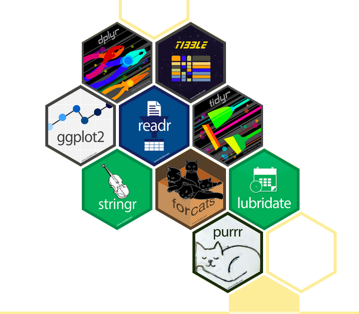

## Introduction to the `tidyverse`

::: columns
::: {.column width="50%"}
[{fig-alt="Hex stickers for all the packages that make up the tidyverse"}](https://www.tidyverse.org/)
:::

::: {.column width="50%"}
-   Set of packages for
    -   wrangling
    -   cleaning
    -   organizing
    -   summarizing
    -   visualizing data
:::
:::

## Example Dataset: Men's World Cup Matches

Source: [`tidytuesdayR`](https://dslc-io.github.io/tidytuesdayR/)

```{r, message = FALSE, warning = FALSE}
library(tidyverse)
library(tidyverse)
library(tidytuesdayR)


tt <- tt_load("2022-11-29")
tt

wc_matches <- tt$wcmatches
glimpse(matches)
```

# `dplyr` {.inverse}

## Verbs

| Verb          | Definition                                                |
|---------------|-----------------------------------------------------------|
| `select()`    | Retrieve particular variables by their name or position   |
| `filter()`    | Retrieve rows meeting condition(s)                        |
| `mutate()`    | Add a variable or transform existing ones                 |
| `group_by()`  | Groups rows that have same value on one or more variables |
| `summarize()` | Run functions on aggregated data                          |
| `arrange()`   | Sort based on a variable in ascending or descending order |
| `slice()`     | Retrieve rows of the data based on their location         |

## `select()`

wnba_draft

```{r}
wc_matches %>%
  select(year, country, stage, home_team, away_team)
```

## `filter()`

```{r}
wc_matches %>%
  filter(stage == "Final")
```

## `mutate()`

```{r}
wc_matches <- 
  wc_matches %>%
  mutate(stage = ifelse(stage == "Final Round", 
                        "Final", stage),
         score_diff = abs(home_score - away_score)) 

wc_matches %>%
  select(year, stage, home_team, away_team, score_diff)
```

## `group_by()` and `summarize()`

```{r}
avg_score_diff <- 
  wc_matches %>%
  filter(stage %in% c("Final", 
                      "Semifinals", 
                      "Quarterfinals", 
                      "Round of 16")) %>%
  group_by(stage) %>%
  summarize(n_matches = n(),
            mean_diff = mean(score_diff),
            sd_diff = sd(score_diff))

avg_score_diff
```

## `arrange()`

```{r}
avg_score_diff <- 
  avg_score_diff %>%
  ungroup() %>%
  mutate(order = case_when(stage == "Round of 16" ~ 1,
                           stage == "Quarterfinals" ~ 2, 
                           stage == "Semifinals" ~ 3, 
                           stage == "Final" ~ 4)) %>%
  arrange(order)

avg_score_diff
```

## `slice()`

```{r}
avg_score_diff %>%
  arrange(desc(mean_diff)) %>%
  slice(1)
```

# `tidyr` {.inverse}

## Verbs

| Verb             | Definition                              |
|------------------|-----------------------------------------|
| `pivot_longer()` | Transform data to long format           |
| `pivot_wider()`  | Transform data to wide format           |
| `separate()`     | Separate a column into multiple columns |
| `unite()`        | Unite multiple columns into one column  |

## `pivot_longer()`

```{r}
long_dat <- 
  avg_score_diff %>%
  select(-order) %>%
  pivot_longer(n_matches:sd_diff,
               names_to = 'stat', 
               values_to = 'val')

long_dat
```

## `separate()`

```{r}
long_dat_clean <- 
  long_dat %>%
  separate(stat, into = c("stat", "var"), sep = "_") 

long_dat_clean
```

## `pivot_wider()`

```{r}
long_dat_clean %>%
  select(-var) %>%
  pivot_wider(names_from = stat, values_from = val) %>%
  rename(Stage = stage, `Number of Matches` = n,
         `Average Difference in Goals` = mean,
         `SD of Difference in Goals` = sd)
```

## `unite()`

```{r}
wc_matches %>%
  unite(world_cup, year, country, sep =  ": ") %>%
  filter(stage == "Final")
```
