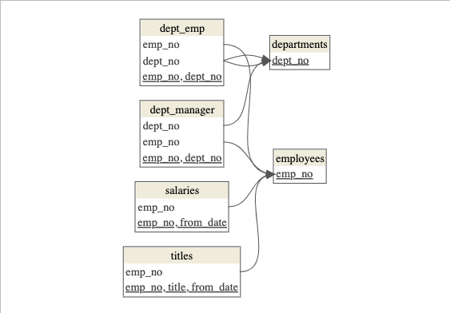
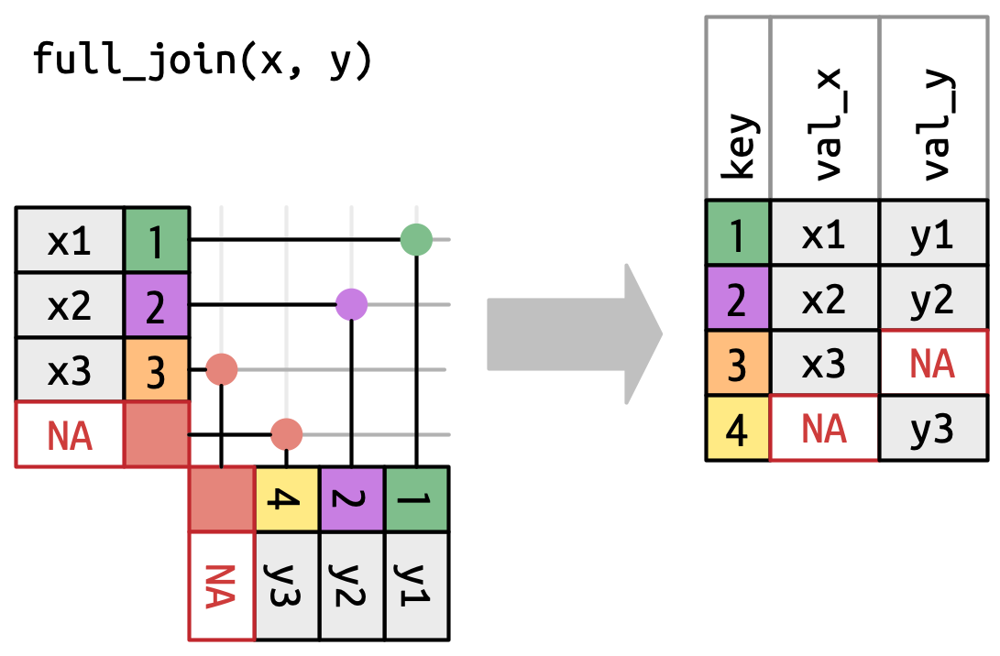
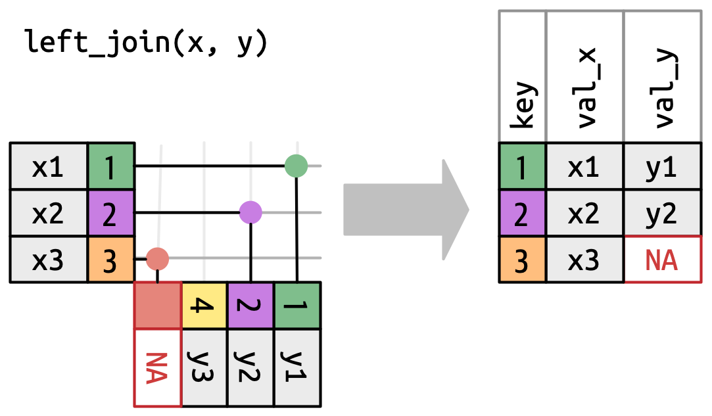
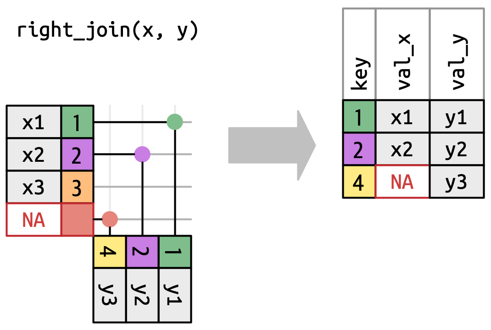
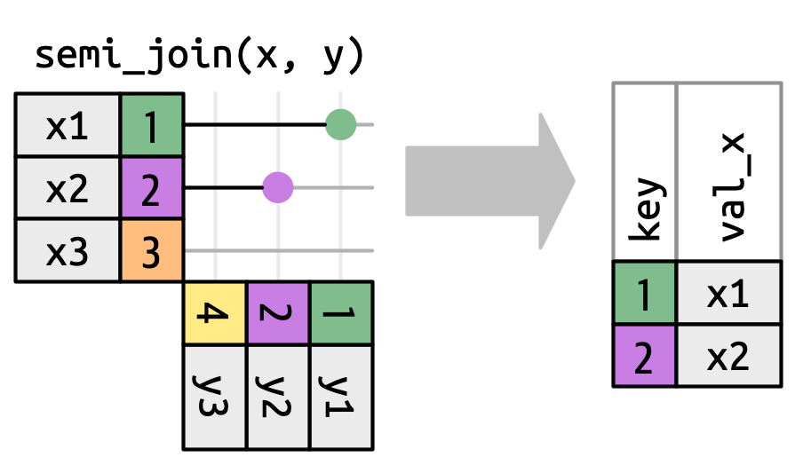
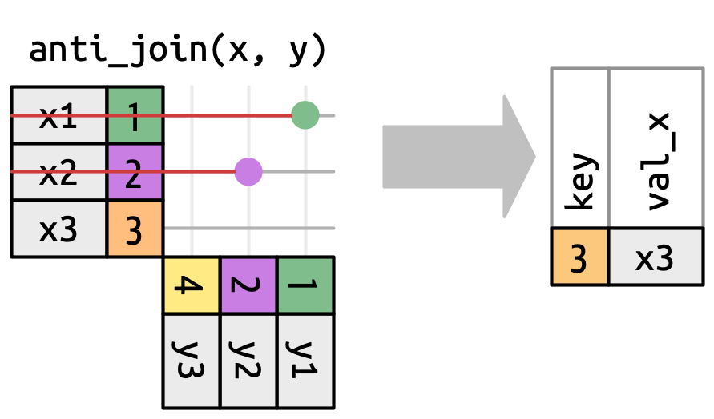

## A Data Frame

::: columns
::: {.column width="50%; font-size: 85%"}
-   Data frames represent data as a table with rows and columns

    -   Rows represent observations or record (e.g., each row contains data on each student)

    -   Columns typically contain variables (e.g., columns contain information like test scores and what school they attended)

-   A tibble is a modern data frame - [Chapter 10 of R4DS](https://r4ds.had.co.nz/tibbles.html)
:::

::: {.column width="50%"}
```{r, warning = FALSE, message = FALSE, echo = FALSE}
library(tidyverse)
library(knitr)
library(kableExtra)

set.seed(20250519)

employee_dat <- tibble(emp_id = c(1:10), 
                       surv_scr = round(rnorm(10, 80, 5)), 
                       dept_id = c(rep("A", 5),
                                    rep("B", 5)),
                       dept_name = c(rep("IT", 5),
                                        rep("Analytics", 5)),
                       dept_mgr = c(rep("Woof", 5),
                                              rep("Meow", 5)))

employee_dat 
```
:::
:::

## Limitations of Data Frames

::: columns
::: {.column width="50%"}
-   Redundant information

    -   In the example data, note that school name and school level information is same for the first five and last five students \~ same information is repeated across 5 rows

-   Storage and memory issues
:::

::: {.column width="50%"}
```{r, echo = FALSE}
employee_dat 
```
:::
:::

## Relational Data

-   Like data frames but now we split the data into multiple tables

-   Cut redundant information, optimize storage and memory, organize the information better

::: columns
::: {.column width="50%"}
Employee data:

```{r, echo = FALSE}
employee_dat 
```
:::

::: {.column width="50%"}
Department data:

```{r, echo = FALSE}
employee_dat %>%
  select(dept_id, dept_name,
         dept_mgr) %>%
  distinct() 
```
:::
:::

## Databases

-   Collection of multiple data

-   **D**ata**b**ase **M**anagement **S**ystem

    -   MySQL

    -   

## Example Database: Employee Database



## Primary Key

-   Every table needs to have a primary key

-   Has to be unique - no duplicated key

-   Cannot have missing data for primary key - we need an identifier

## Foreign Keys

# Mutating Joins {.inverse}

## Definition

## Full Outer Join

Join all the rows of both tables as long as there is a matching record in either table.

## [](https://r4ds.hadley.nz/joins#how-do-joins-work)

## Left Outer Join or Left Join

Join all the rows of the left table and the matching rows in the right table.

[{width="580"}](https://r4ds.hadley.nz/joins#how-do-joins-work)

## `left_join()`

```{r}

```

## Right Outer Join

Join all the rows of the right table and the matching rows in the left table.

## [](https://r4ds.hadley.nz/joins#how-do-joins-work)Inner Join

Join the rows which are present in both tables.

## Self Join

Join a table with itself.

## Cross Join or Cartesian Join

Returns all possible combinations of all rows.


# Filtering Joins {.inverse}

## Semi Join

Filter records from left table that has matching records in right table.



## Anti Join

Filter records from left table that do not have matching records in right table.

#  {.inverse}

# Set {.inverse}

## Intersect

## Union

## Difference or Minus
