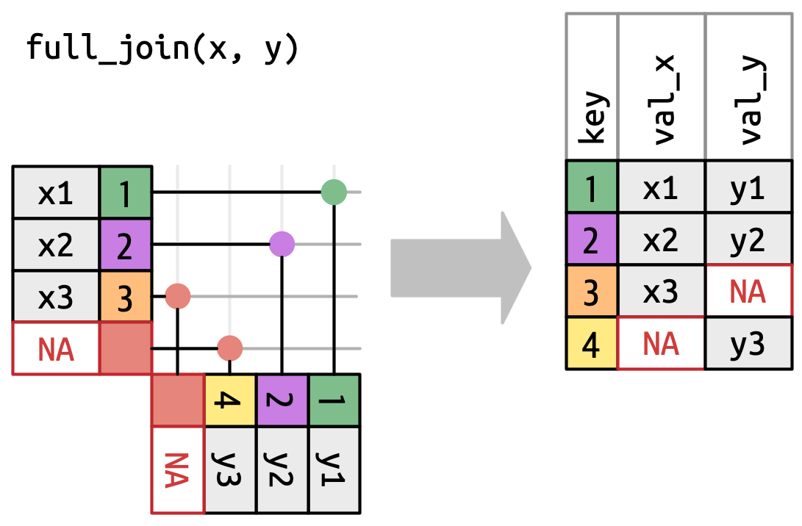
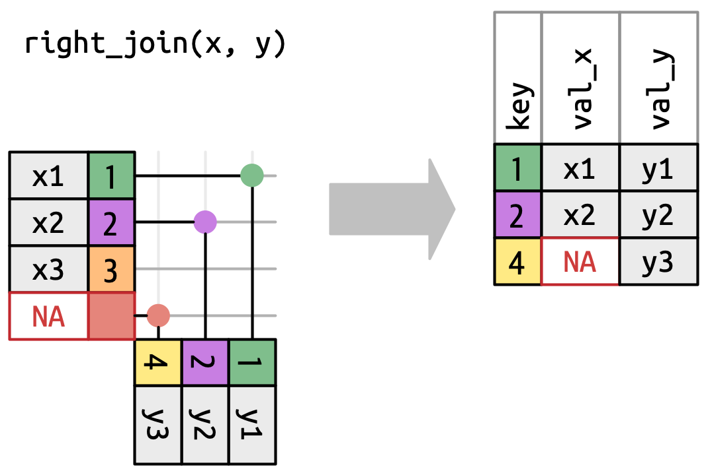
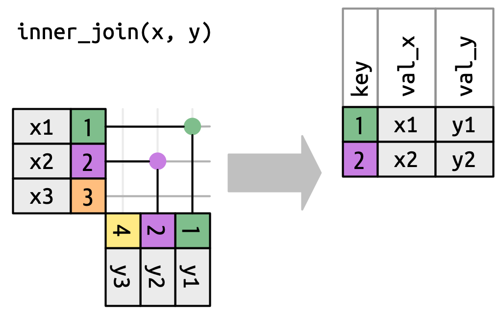
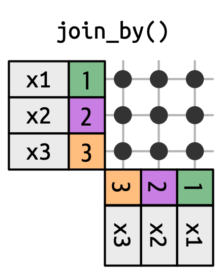
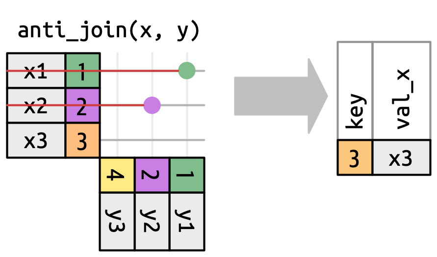

## A Data Frame

::: columns
::: {.column width="50%; font-size: 85%"}
-   Data frames represent data as a table with rows and columns

    -   Rows represent observations or record (e.g., each row contains data on employee)

    -   Columns typically contain variables (e.g., columns contain information like score on employee satisfaction survey, what department the employee belongs to etc.)

-   A tibble is a modern data frame - [Chapter 10 of R4DS](https://r4ds.had.co.nz/tibbles.html)
:::

::: {.column width="50%"}
```{r, warning = FALSE, message = FALSE, echo = FALSE}
library(tidyverse)
library(knitr)
library(kableExtra)

load("../data/employee_dat_practice/employee_database.RData")

emp_dept_dat <- inner_join(department_dat, 
                           employee_dat, 
                           by = "dept_id")

emp_dept_dat
```
:::
:::

## Limitations of Data Frames

::: columns
::: {.column width="50%"}
-   Redundant information

    -   In the example data, note that department name repeats \~ same information is repeated across 4 rows

-   Storage and memory issues
:::

::: {.column width="50%"}
```{r, echo = FALSE}
emp_dept_dat 
```
:::
:::

## Relational Data

-   Like data frames but now we split the data into multiple tables

-   Cut redundant information, optimize storage and memory, organize the information better

::: columns
::: {.column width="50%"}
Employee data:

```{r, echo = FALSE}
emp_dept_dat %>%
  select(emp_id:dept_id)
```
:::

::: {.column width="50%"}
Department data:

```{r, echo = FALSE}
emp_dept_dat %>%
  select(dept_id, dept_name) %>%
  distinct() 
```
:::
:::

## Databases

-   Collection of multiple data

-   **D**ata**b**ase **M**anagement **S**ystem

    -   MySQL

    -   DuckDB

## Example Dataset Full

::: columns
::: {.column width="50%"}
```{r, echo = TRUE}
employee_dat
```
:::

::: {.column width="50%"}
```{r}
department_dat
```
:::
:::

::: notes
What do you notice about the relationship between the two datasets?
:::

## Primary Key

-   Every table needs to have a primary key

-   Has to be unique - no duplicated key

-   Should not have missing data for primary key - we need an identifier

    -   Example:

        -   Employee ID in the employee dataset (`dept_emp`)

        -   Department number in the department manager dataset (`dept_manager`)

## Foreign Keys

-   Counterpart to the primary key

-   An identifier in a another table that matches with the primary key in a table

    -   Example:

        -   Department number is a foreign key in `dept_emp` data that matches with the primary key department number in the `dept_manager` data

# Mutating Joins {.inverse}

## Full Outer Join

Join all the rows of both tables as long as there is a matching record in either table.

{width="533"}

`full_join`

```{r}
full_join(employee_dat, department_dat, by = "dept_id")
```

## Left Outer Join or Left Join

Join all the rows of the left table and the matching rows in the right table.


## `left_join()`

```{r}
left_join(employee_dat, department_dat, by = "dept_id")
```

## Right Outer Join

Join all the rows of the right table and the matching rows in the left table.

{width="533"}

## `right_join()`

```{r}
right_join(employee_dat, department_dat, by = "dept_id")
```

## Inner Join

Join the rows which are present in both tables.

{width="533"}

## `inner_join()`

```{r}
inner_join(department_dat, employee_dat, by = "dept_id")
```

## Cross Join or Cartesian Join

Returns all possible combinations of all rows.

{width="421"}

## `cross_join()`

```{r}
cross_join(employee_dat, department_dat)
```

# Filtering Joins {.inverse}

## Semi Join

Filter records from left table that has matching records in right table.

{width="534"}

## `semi_join()`

```{r}
semi_join(employee_dat, department_dat, by = "dept_id")
```

## Anti Join

Filter records from left table that do not have matching records in right table.



## `anti_join()`

```{r}
anti_join(employee_dat, department_dat, by = "dept_id")
```

# Thank you! {.inverse}
