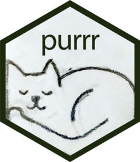

# Functions {.inverse}

## Example Dataset Background

-   Tennessee’s Student/Teacher Achievement Ratio (STAR) [(Mosteller, 1995)](https://edsource.org/wp-content/uploads/old/STAR.pdf)

-   Longitudinal project examining effect of class size on student achievement

-   Data on language, math, reading outcomes

-   The data that we are using is from the `evalITR` package

    -   Please review information about the data [here](https://michaellli.github.io/evalITR/reference/star.html)

## Example Dataset

```{r, warning = FALSE, message = FALSE}
library(tidyverse)
library(janitor)
library(evalITR)
library(estimatr)
library(broom)

star_dat <- star %>%
    clean_names()

glimpse(star_dat)
```

## Run a Linear Regression to Assess the Impact of Treatment on Language

```{r}
lang_mod <- lm_robust(g3tlangss ~ treatment + gender + race + schlurbn + grdrange + gkenrmnt, 
                  data = star_dat,
                  se_type = "HC2")

summary(lang_mod)
```

## Tidy Language Results

```{r}
tidy(lang_mod) %>%
    filter(term == "treatment") %>%
    mutate(outcome = "g3tlangss") %>%
    dplyr::select(outcome, everything())
```

## On Math

```{r}
math_mod <- lm_robust(g3tmathss ~ treatment + gender + race + schlurbn + grdrange + gkenrmnt, 
                  data = star_dat,
                  se_type = "HC2")

summary(math_mod)
```

## Tidy Math Results

```{r}
tidy(lang_mod) %>%
    filter(term == "treatment") %>%
    mutate(outcome = "g3tlangss") %>%
    dplyr::select(outcome, everything())


```

## On Reading

```{r}
read_mod <- lm_robust(g3tlangss ~ treatment + gender + race + schlurbn + grdrange + gkenrmnt, 
                  data = star_dat,
                  se_type = "HC2")

summary(read_mod)
```

## Tidy Reading Results

```{r}
tidy(read_mod) %>%
    filter(term == "treatment") %>%
    mutate(outcome = "g3tlangss") %>%
    dplyr::select(outcome, everything())
```

## Repetition

-   Redundant code

-   Repetitive

-   Prone to error when copy and pasting and changing a few things. Can you list out all the errors I made just now?

-   If we want to change the model, let's say add few other variables, we have to repeat that correction multiple times

    -   Which may also open up space for more error

## Functions

::: columns
::: {.column width="50%"}
-   Input

-   Do something with the input

-   Output

-   Run it over again with different input
:::

::: {.column width="50%"}
```{r}
sum_it <- function(x, # input 1 
                   y  # input 2
                   ){
  
  total <- x + y # do something with the input
  
  return(total) # output
  

}

sum_it(2, 3)

sum_it(1000, 5000)
```
:::
:::

## Function Example

```{r}
run_reg <- function(outcome_var) {

    lm_equation <- paste(outcome_var, " ~  treatment + gender + race + schlurbn + grdrange + gkenrmnt")

    mod <- lm_robust(as.formula(lm_equation), 
                     data = star_dat,
                     se_type = "HC2")

    res_clean <- tidy(mod) %>%
        filter(term == "treatment") %>%
        mutate(outcome = outcome_var) %>%
        dplyr::select(outcome, everything())

                
    return(res_clean)
    
}
```

## Run the Function

```{r}
run_reg(outcome = "g3tlangss")
run_reg(outcome = "g3tmathss")
run_reg(outcome = "g3treadss")
```

## Critiques of the `run_reg()` Function

-   Can you think of potential issues with this function?

-   What are the issues and consequences of those issues?

-   What can you do to improve the function?

## Repetition

-   For the sake of this presentation, I am only showing three outcomes

-   Imagine if there were more than 10 outcomes that you needed to analyze

-   Think of potential issues in this situation - both when doing brute force analysis and even when using a function like `run_reg()`

# Iteration {.inverse}

## Repetitive Tasks Examples

-   Running analysis for multiple outcomes like above

-   Reading in 50 csv files in a folder with different csv files containing data for different school year

-   Conduct power analysis to estimate sample size for a randomized trial based on multiple assumed values of the effect size

## For Loops

::: columns
::: {.column width="50%"}
-   Classic way to run repetitive analyses or tasks

-   For each item in a vector of items, run the code
:::

::: {.column width="50%"}
```{r}
numbers <- 1:10 # A vector of items to loop through

for(n in numbers){ # for each number in the vector numbers
  
  x <- n * 2 # multiply the number by 2
  
  print(x) # print the result
  
  
}
```
:::
:::

## STAR Analysis Example: Loop through Outcomes

```{r}
outcome <- c("g3tlangss", "g3tmathss", "g3treadss") # outcomes to loop through

res <- NULL # initialize the results 

for(y in outcome){ # for each outcome in the outcome vector 
  
  output <- run_reg(outcome = y) # run run_reg for that outcome
  res <- bind_rows(res, output) # append the output to res
  
  
}

res # look at res after the looping

```

## For Loops are Slow...

-   For loops are still clunky and involve fairly extensive coding
-   Need to think through how to append and store the outcome or print the outcome
-   Also a bit slow..(er than other stuff we are going to talk about) in R

## `purrr`

::: columns
::: {.column width="30%"}

:::

::: {.column width="70%"}
-   Functional programming in R

-   Like for loop - apply a function to each element in a vector but less clunky

-   Major family of functions: `map()`

    ::: nonincremental
    -   Loop over a vector and output some value

    -   Different variations of `map()` will return different types of output

    -   Please read through the different variations [here](https://purrr.tidyverse.org/reference/map.html)
    :::
:::
:::

## `map()`

```{r}
numbers <- 1:5 # vector with items to loop over

# function that you want run
times_two <- function(x){
  x * 2
}

# loop times_two through each number, notice the output
map(numbers, .f = times_two)
```

## Different Output Format

```{r}
map_int(numbers, .f = times_two)
```

## Back to our `run_reg()`

```{r}
map_dfr(outcome, run_reg)
```

## Functions with Multiple arguments

-   The `map()` family of functions is limited in that we can only loop through one thing

-   We may run into a scenario where we want through loop through multiple things

-   Can you think of some such scenarios?

-   In such case, we can use the `pmap()` family of functions. Please read through <https://purrr.tidyverse.org/reference/pmap.html>

# Thank you!! {.inverse}
